title: ZCU102+ADRV9009使用GNU Radio开发使用
author: Roxy
tags:
  - Linux
  - GNU Radio
categories: []
date: 2022-12-07 16:55:00
---
# ZCU102+ADRV9009使用GNU Radio开发使用

## GNU Radio的安装

### Linux下的安装

以ubuntu系统为例，建议更新至ubuntu 22.04 LTS，22.04的ubuntu才有GNU Radio 3.10.4.0的版本，里面自带有我们需要的ADI公司的**PlutoSDR**或是**FMCOMMS-2/3/4**两种GNU块

#### 一、首先下载和编译libiio库：

```shell
(sudo) apt install libxml2 libxml2-dev bison flex cmake git libaio-dev libboost-all-dev
```

#### 二、然后从源代码编译和安装好libiio库：

```shell
git clone https://github.com/analogdevicesinc/libiio.git
cd libiio
mkdir build
cd build
cmake .. -DPYTHON_BINDINGS=ON
make 
sudo make install
cd ../..
```

#### 三、安装GNU Radio：

新版的GNU Radio不再需要从源代码开始编译安装，避免了很多安装时候出现的错误，Ubuntu仅仅只需要一行代码即可安装

```sh
sudo apt-get update
sudo apt install gnuradio
```

### Windows下的安装

+ 首先确保安装了[Anaconda](https://www.anaconda.com/products/individual-d)

+ 切换Anaconda安装虚拟环境路径

  ```shell
  conda config --add envs_dirs {路径}
  ```

+ 如果需要更改[Anaconda为国内源请看](https://blog.csdn.net/qq_47403533/article/details/116886693?ops_request_misc=%257B%2522request%255Fid%2522%253A%2522167040016016782388033348%2522%252C%2522scm%2522%253A%252220140713.130102334..%2522%257D&request_id=167040016016782388033348&biz_id=0&utm_medium=distribute.pc_search_result.none-task-blog-2~all~sobaiduend~default-1-116886693-null-null.142^v68^wechat,201^v4^add_ask,213^v2^t3_esquery_v1&utm_term=anaconda%E6%9B%B4%E6%8D%A2%E5%9B%BD%E5%86%85%E9%95%9C%E5%83%8F%E6%BA%90&spm=1018.2226.3001.4187)

#### 一、创建Anaconda环境

创建新环境命令

```sh
conda create -n gnuradio python==3.8
```

查看当前所有环境命令

```sh
conda info --env
```

进入创建的环境

```sh
conda activate gnuradio
```

删除环境

```sh
conda remove -n gnuradio --all
```

#### 二、安装GNU Radio

进入创建的gnuradio环境后，安装gnuradio和其依赖包

```sh
conda install gnuradio
```

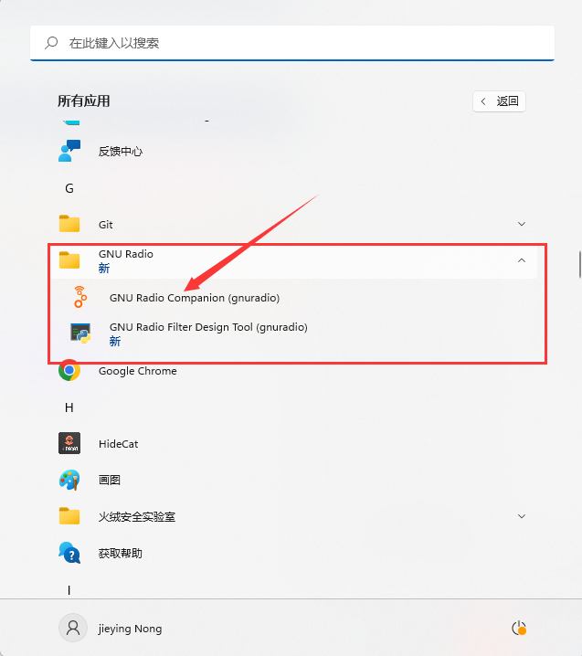

点击启动该程序

### GNU Radio的使用

window版本若是用官方推荐的WSL版本下功能比较有限，基本只能使用包含的库，一般用于做测试用，如果想引入一些外部的库还是尽量使用Linux版本下的，但是我找到的方法是Anaconda版本的GNU Radio，其实和linux也并没有多大差别，也能较为方便的引入github上的库。

GNU radio的基本使用这里不做过多赘述，详细可以看b站里这个视频作为简单[学习入门](https://www.bilibili.com/video/BV1cf4y1r7iM/?share_source=copy_web&vd_source=d2960ae1aa34ba622d2828e7765ee645)


需要简单知道的就是

+ Signal Source：即信号源
+ QT GUI +名字里带Sink的：可理解为用QT GUI在显示器上显示的示波器

例如我做的这个简单的例程，信号源out然后输入in到时域示波器和频域示波器

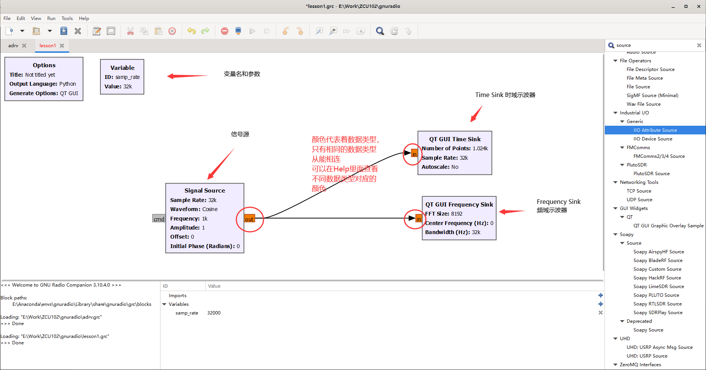

可以点左上角Run展开菜单后运行，也可以用快捷键

+ **F5：根据你绘制的Radio图生成python代码**
+ **F6：运行**
+ **F7：停止**

## GNU Radio对ZCU102+ADRV9009的使用

其实ZCU102并不需要什么配置，只需要保证硬件上如下设置

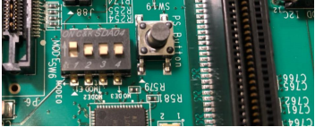

且插入的SD卡已经写入Linux镜像即可，其他的环境我已经都搭好了

然后将ZCU102与我们进行操控的PC主机用USB to Micro-a相连，**注意一定链接到ZCU102的UART口上**

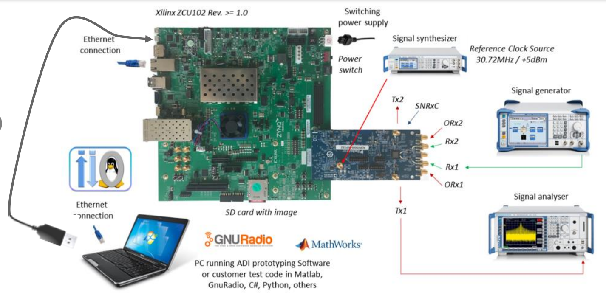

**且将ZCU102至于与PC端同一局域网环境下**

启动电源

这里推荐使用MobaXterm进行控制

新建会话

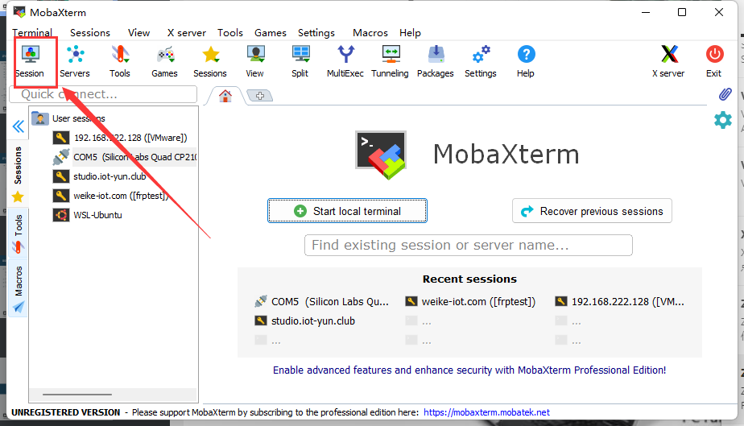


选择端口

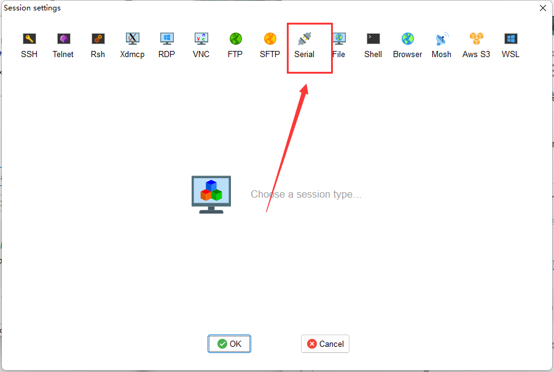


波特率为115200，四个选项中一个一个创建然后按回车键实验，若出现正常Linux界面则进入正确，一般是数字的顺数第二个端口

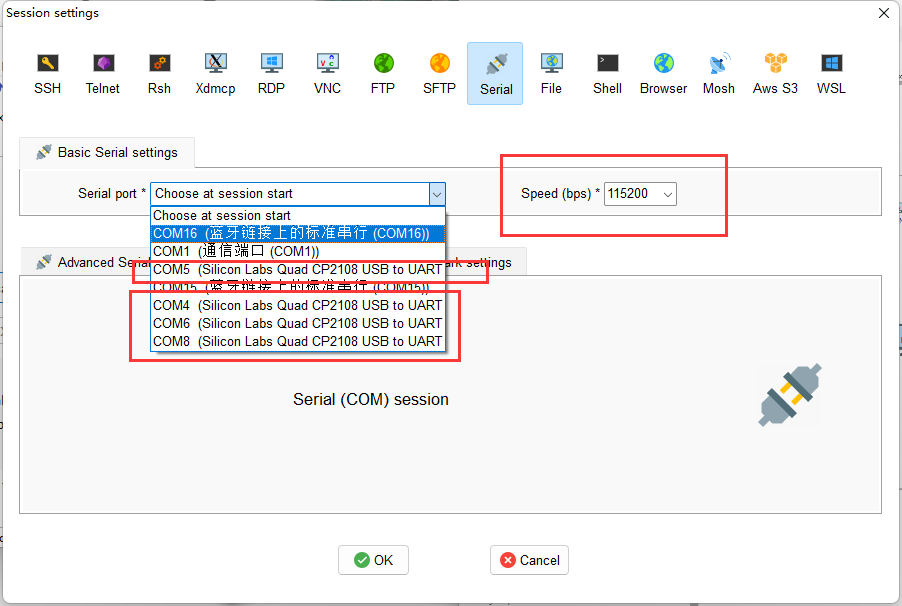


这里是在进行加载Linux系统，等待加载完毕

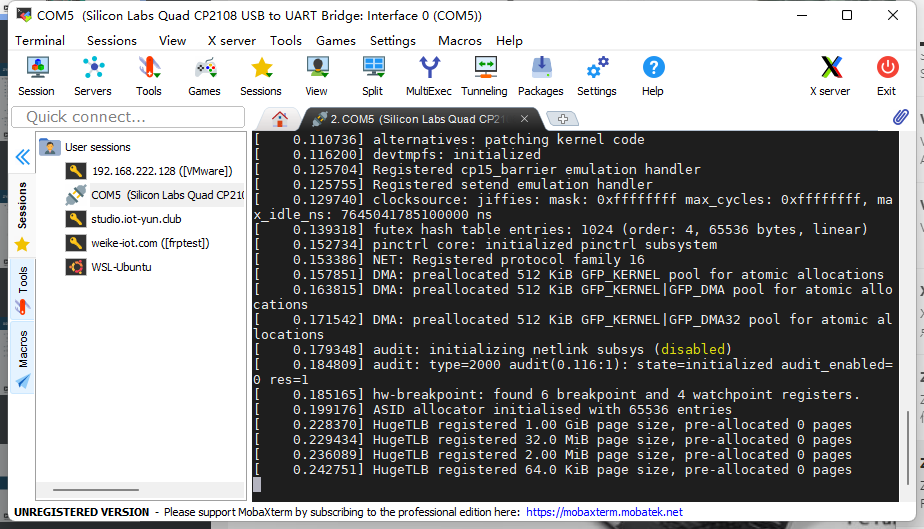


正常进入板载Linux

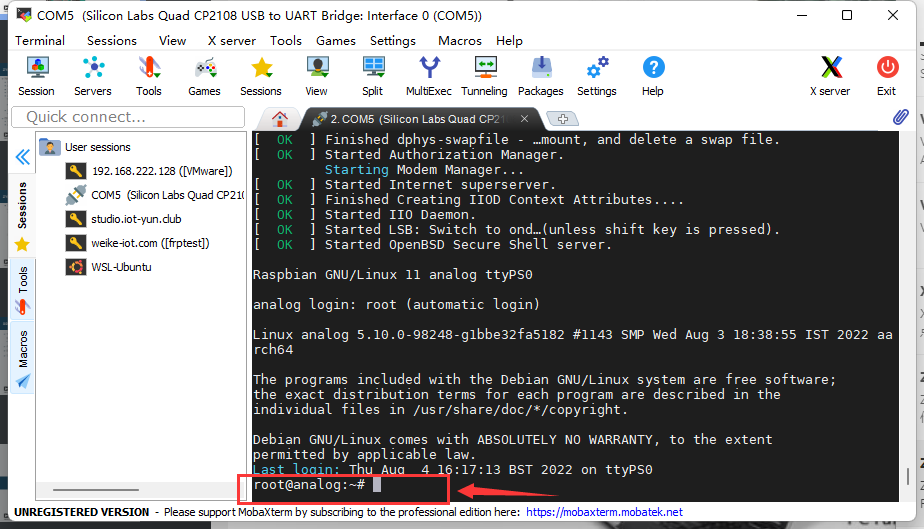


输入指令查看linux被分配的ip地址

```sh
ifconfig
```

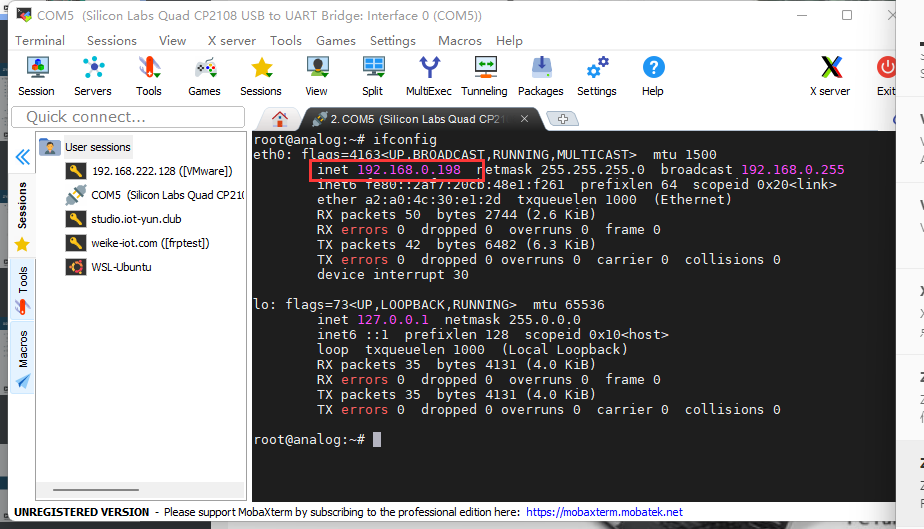

可以看到被分配ip地址为

192.168.0.198 


回到pc端命令台

使用

```sh
iio_attr -a -C
```

寻找内网内设备

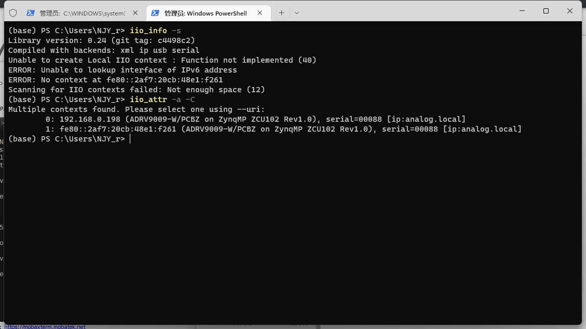

如图示，查找到了ADRV9009的IPv4地址，和我们前面在板载Linux下查看的地址相同

### 回到GNU Radio 

ADI官方在[gr-iio的github项目](https://github.com/analogdevicesinc/gr-iio)下有一个./iio-examples的文件夹，里面ADI官方提供了几个使用 FMCOMMS-2/3/4 IIO 块的示例流程图

也可以下载那几个作为例程更改使用

下面简述下我做的几个

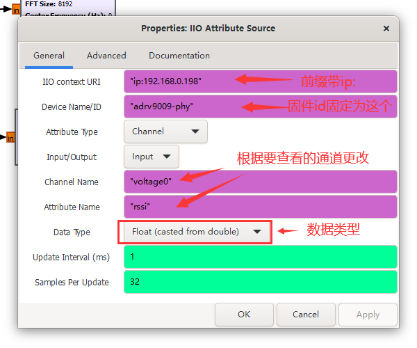